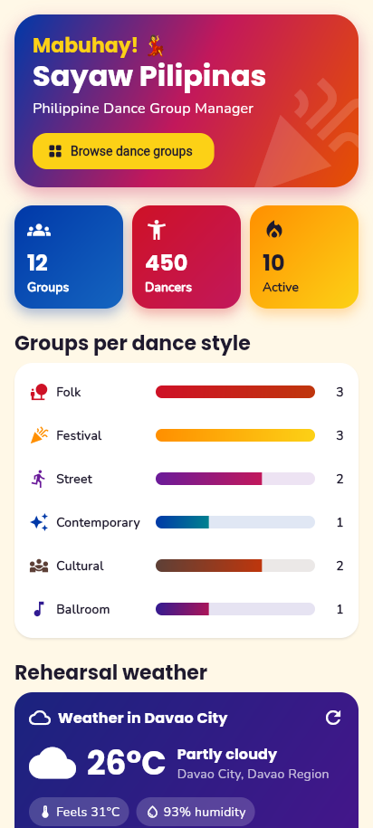
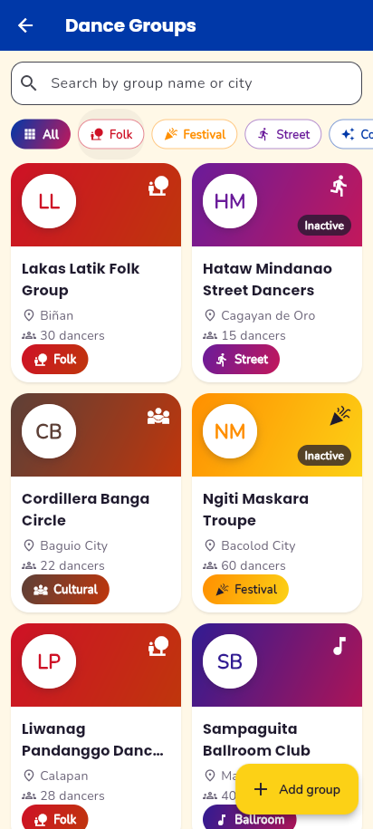
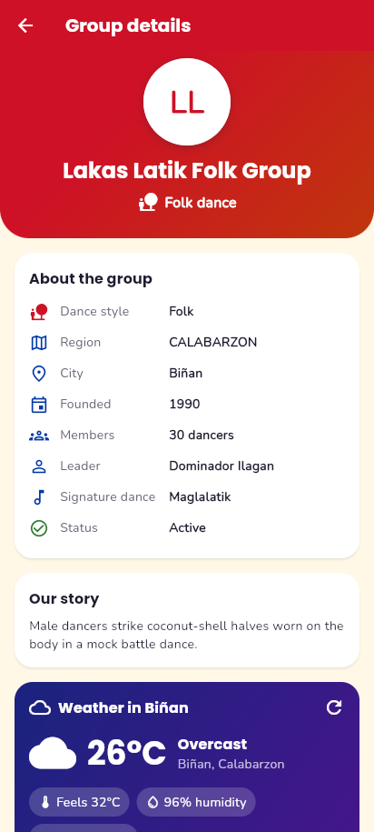
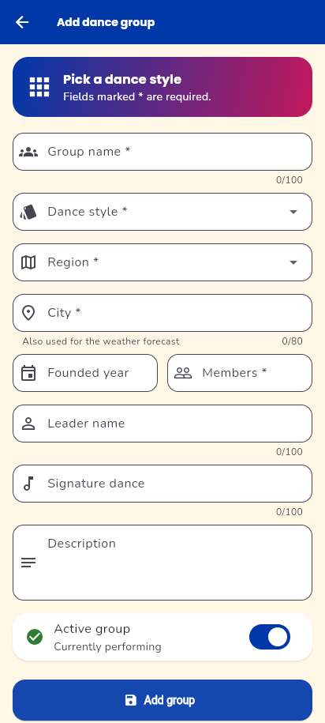

# Sayaw Pilipinas: Philippine Dance Group Manager

A Flutter mobile app for managing Philippine dance groups (folk, festival, street, contemporary, cultural/indigenous, and ballroom). It does full CRUD through its own PHP REST API backed by MySQL, and shows live weather for each group's city from a third-party API so groups can plan outdoor rehearsals.

**Third-Party API: Open-Meteo – https://open-meteo.com**
- Geocoding (city → coordinates): `https://geocoding-api.open-meteo.com/v1/search`
- Current weather: `https://api.open-meteo.com/v1/forecast`
- Free and needs no API key. Weather data by [Open-Meteo.com](https://open-meteo.com/) (CC BY 4.0).

## Features mapped to the rubric

| Rubric item | Where it is in the app |
|---|---|
| **READ (GET)** | The Groups screen shows every group in a responsive grid (2 columns on phones, more on wider screens) with search, dance-style filters, and pull-to-refresh. Tap a card to open the detail screen. The dashboard shows totals and groups per style. |
| **CREATE (POST)** | The "Add group" button opens a form with validation under each field. After saving, the new group appears at the top of the list with no manual refresh. |
| **UPDATE (PUT)** | On the detail screen, **Edit** opens the same form, pre-filled. The changes are saved to the database. |
| **DELETE (DELETE)** | On the detail screen, **Delete** shows a confirmation dialog ("Delete [name]? This cannot be undone.") before the record is removed. |
| **Third-party API** | Open-Meteo weather card on the dashboard and on every group's detail screen. It has loading, error with Retry, and "no data" states. |

Other details:
- "Filipino fiesta" theme: each dance style has its own colors and icon.
- Animations: Hero avatar, staggered cards, a bouncy add button.
- Colored SnackBars, an empty state, and an error state with Retry.

## Tech stack

- **App:** Flutter (Dart), `http`, `google_fonts`, `setState` for state
- **Backend:** PHP 8 with plain PDO and prepared statements (no framework)
- **Database:** MySQL / MariaDB, managed with phpMyAdmin (XAMPP)

## Project structure

```
backend/api/dance_groups.php   REST API (GET, POST, PUT, DELETE)
backend/api/health.php         Database connection check
backend/config/                db.php (connection) + config.example.php
database/                      SQL for local XAMPP and for shared hosting
lib/config/app_config.dart     The only place with URLs
lib/models/                    DanceGroup, Weather
lib/services/                  api_service.dart (CRUD), external_api_service.dart (Open-Meteo)
lib/screens/                   dashboard, groups, group detail, group form
lib/widgets/                   cards, chips, empty/error states, weather card
run_app.bat                    Menu to run on the emulator, a phone, online, or Chrome
```

## REST API endpoints

Base URL (local): `http://localhost/api`

| Method | URL | Action | Success |
|---|---|---|---|
| GET | `/dance_groups.php` | List all groups (newest first) | 200 |
| GET | `/dance_groups.php?id=1` | Get one group | 200 / 404 |
| POST | `/dance_groups.php` + JSON body | Create a group, returns the new record | 201 |
| PUT | `/dance_groups.php?id=1` + JSON body | Update a group, returns the updated record | 200 / 404 |
| DELETE | `/dance_groups.php?id=1` | Delete a group | 200 / 404 |
| GET | `/health.php` | Check the database connection | 200 |

- If a host blocks PUT or DELETE, send `POST` with `"_method": "PUT"` or `"_method": "DELETE"` in the JSON body.
- Errors:
  - `422` validation failed, with a message for each field
  - `400` bad JSON or id
  - `405` method not allowed
  - `500` generic database error
- Every response uses the same JSON shape:

```json
{ "success": true, "message": "Dance group loaded.", "data": { "id": 1, "group_name": "..." } }
```

## Local setup (XAMPP + Flutter)

1. **Start XAMPP:** start **Apache** and **MySQL**.
2. **Database:** in phpMyAdmin (`http://localhost/phpmyadmin`), open the **SQL** tab, paste the contents of `database/dance_troupph.sql`, and click **Go**. This creates the database `dance_troupph`, the table `dance_groups`, and 12 fictional sample groups.
3. **Backend config:** copy `backend/config/config.example.php` to `backend/config/config.php` and fill in your MySQL user and password. For XAMPP the defaults are `root` and an empty password.
4. **Put the API in htdocs:** so that `http://localhost/api/health.php` works, either copy the `backend` folder contents into `C:\xampp\htdocs\`, or link the folder. Run this in PowerShell as one line:
   ```powershell
   New-Item -ItemType Junction -Path C:\xampp\htdocs\api -Target <repo>\backend\api
   ```
   Open `http://localhost/api/health.php`. It should say "API and database are working."
5. **Run the app:** double-click `run_app.bat` and pick a target:
   - **1 – Emulator:** uses `http://10.0.2.2/api` (10.0.2.2 is the emulator's name for your PC)
   - **2 – Phone (USB):** uses your PC's Wi-Fi IP, e.g. `http://192.168.1.5/api`. The phone must be on the same Wi-Fi, and you may need to allow Apache through Windows Firewall.
   - **3 – Online server:** your HTTPS URL
   - **4 – Chrome:** `http://localhost/api`

   Or run it manually: `flutter run --dart-define=API_BASE_URL=http://10.0.2.2/api`

> **Why different URLs?** `localhost` always means "this device". On the phone, `localhost` is the phone itself, not your PC, so the app needs the PC's address instead.

Plain `http://` is allowed only in **debug** builds (`android/app/src/debug/AndroidManifest.xml`) for local testing. Release builds need HTTPS.

## Tests

```
flutter analyze
flutter test
```

## Screenshots

| Dashboard | Groups | Detail | Form |
|---|---|---|---|
|  |  |  |  |

Add your own screenshots to a `screenshots/` folder with these names.

## Sample data

All dance groups and leader names in the sample data are **fictional**.
